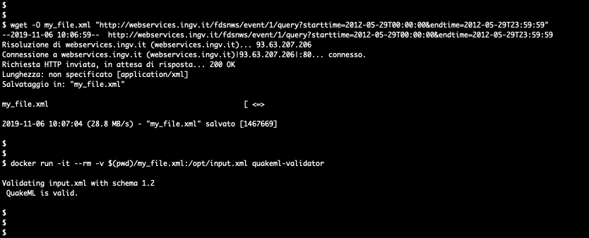

[](https://github.com/INGV/quakeml-validator/blob/master/LICENSE)
[](https://github.com/INGV/quakeml-validator/issues)
[](https://ingv-institute.slack.com/messages/CKS902Y5B)
[](https://ingv-institute.slack.com/)

# quakeml-validator []()

This tool validate an XML file with QuakeML-1.2.xsd schema

## Quickstart
### Build docker
```
$ git clone https://github.com/ingv/quakeml-validator
$ cd quakeml-validator
$ docker build --tag quakeml-validator .
```

### Run docker
```
$ docker run -it --rm -v $(pwd)/your_file_to_validate.xml:/opt/input.xml quakeml-validator
```

### Example screenshot


# Contribute
Please, feel free to contribute.

# Author
(c) 2019 Valentino Lauciani valentino.lauciani[at]ingv.it

Istituto Nazionale di Geofisica e Vulcanologia, Italia
